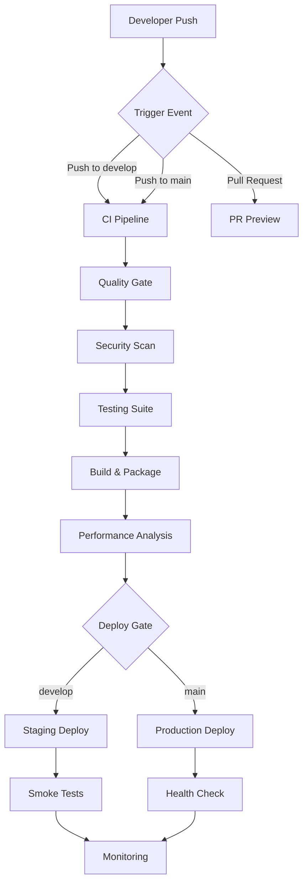

# CI/CD Pipeline Guide - PakeAja CRM

## 🚀 Pipeline Architecture

Our CI/CD pipeline implements enterprise-grade best practices with a **3-tier deployment strategy** that ensures code quality, security, and reliability.



## 📋 Pipeline Stages

### 1. **Quality Gate** (Code Analysis)
```yaml
✅ Type checking (TypeScript)
✅ Code linting (ESLint) with auto-fix
✅ Code formatting (Prettier)
✅ Dependency caching for faster builds
✅ Parallel execution for efficiency
```

### 2. **Security Scanning**
```yaml
✅ Vulnerability scanning (Trivy)
✅ Secret detection (TruffleHog)
✅ Dependency review (GitHub)
✅ SARIF report generation
✅ Security audit (npm audit)
```

### 3. **Testing Suite** (Parallel Matrix)
```yaml
✅ Unit Tests (Business Logic)
✅ Integration Tests (API & Database)
✅ E2E Tests (User Workflows)
✅ Smoke Tests (Critical Paths)
✅ Code Coverage Reporting
```

### 4. **Build & Package**
```yaml
✅ Next.js optimized build
✅ Build caching for faster CI
✅ Asset optimization
✅ Environment configuration
✅ Artifact storage
```

### 5. **Performance Analysis**
```yaml
✅ Bundle size analysis
✅ Lighthouse performance audit (5 key pages)
✅ Core Web Vitals monitoring
✅ Performance regression detection
✅ Accessibility compliance
```

### 6. **Deployment Gates**
```yaml
✅ Environment-specific builds
✅ Automated health checks
✅ Smoke test execution
✅ Rollback capabilities
✅ Deployment notifications
```

## 🌍 Environment Strategy

### **Development Workflow**
```bash
feature/new-feature → develop → main → production
```

| Environment | Branch | URL | Purpose |
|-------------|--------|-----|---------|
| **Preview** | PR → main | Dynamic URL | Code review & testing |
| **Staging** | develop | pakeaja-crm-staging.vercel.app | Integration testing |
| **Production** | main | pakeaja-crm.vercel.app | Live application |

## 🔧 Local Development

### **Setup**
```bash
cd horizon-suite
npm install
npm run dev
```

### **Pre-commit Checks**
```bash
npm run pre-commit  # Runs lint, type-check, format, unit tests
npm run pre-push    # Runs full test suite + security scan
```

### **Testing**
```bash
npm run test:unit        # Unit tests
npm run test:integration # Integration tests
npm run test:e2e        # End-to-end tests
npm run test:smoke      # Smoke tests
npm run test:ci         # All tests (CI mode)
npm run test:coverage   # Coverage report
npm run test:watch      # Watch mode
```

### **Performance & Analysis**
```bash
npm run analyze         # Bundle analysis
npm run lighthouse      # Performance audit
npm run performance     # Full performance suite
npm run security:scan   # Security audit
```

## 🚦 CI/CD Best Practices Implemented

### **1. Fail Fast Strategy**
- **Quality Gate First**: Code quality checks run before expensive operations
- **Parallel Execution**: Jobs run simultaneously where possible
- **Smart Caching**: Dependencies and builds cached for speed
- **Early Feedback**: Developers get feedback within 5-10 minutes

### **2. Security First**
- **Multi-layer Scanning**: Trivy + TruffleHog + npm audit
- **SARIF Integration**: Security findings in GitHub Security tab
- **Dependency Review**: Automatic PR dependency analysis
- **Security Headers**: Comprehensive security headers in Vercel config
- **Secret Management**: GitHub Secrets for sensitive data

### **3. Performance Monitoring**
- **Lighthouse CI**: Automated performance audits on 5 key pages
- **Bundle Analysis**: Track bundle size changes and optimization
- **Core Web Vitals**: Real user metrics monitoring
- **Performance Budgets**: Fail builds on performance regressions

### **4. Deployment Safety**
- **Blue-Green Deployment**: Zero-downtime deployments via Vercel
- **Health Checks**: Comprehensive post-deployment verification
- **Smoke Tests**: Critical path validation
- **Automatic Rollback**: Failed deployments trigger rollback
- **Deployment Tags**: Version tracking for production releases

### **5. Developer Experience**
- **Preview Deployments**: Every PR gets a unique URL with quick links
- **Rich PR Comments**: Deployment status, performance metrics, and links
- **Quality Gate Reports**: Detailed status in PR comments
- **Fast Feedback**: Optimized for quick iteration cycles
- **Comprehensive Documentation**: This guide and inline comments

## 📊 Pipeline Metrics & SLAs

### **Performance Targets**
```yaml
Build Time: < 5 minutes
Test Suite: < 10 minutes
Deployment: < 3 minutes
Total Pipeline: < 15 minutes
```

### **Quality Gates**
```yaml
Code Coverage: > 80%
Performance Score: > 80 (Lighthouse)
Accessibility Score: > 90
Security Audit: 0 high/critical vulnerabilities
Bundle Size: < 1.6MB total
```

### **Availability Targets**
```yaml
Production Uptime: 99.9%
Staging Uptime: 99%
Preview Deployments: 95%
Health Check Response: < 2 seconds
```

## 🔍 Monitoring & Alerts

### **GitHub Actions Notifications**
- ✅ Successful deployments with version tags
- ❌ Failed builds/deployments with detailed logs
- ⚠️ Performance regressions with metrics
- 🔒 Security vulnerabilities with SARIF reports
- 📊 Quality gate status in PR comments

### **Vercel Integration**
- 📊 Real-time performance metrics
- 🚨 Error tracking and alerts
- 📈 Usage analytics and insights
- 🔄 Automatic scaling based on traffic
- 📱 Mobile performance monitoring

### **Automated Issue Creation**
- 🚨 Production deployment failures create urgent issues
- 📊 Performance regression alerts
- 🔒 Security vulnerability notifications
- 📈 Weekly performance reports

## 🛠️ Troubleshooting

### **Common Issues**

#### **Build Failures**
```bash
# Check type errors
npm run type-check

# Check linting issues
npm run lint

# Fix formatting
npm run format

# Clean build
npm run clean && npm run build
```

#### **Test Failures**
```bash
# Run specific test
npm run test:unit
npm run test -- --grep "specific test"

# Debug mode
npm run test:debug

# Check coverage
npm run test:coverage
```

#### **Deployment Issues**
```bash
# Check Vercel logs
vercel logs

# Manual deployment
vercel --prod

# Health check
npm run health-check
```

#### **Performance Issues**
```bash
# Analyze bundle
npm run analyze

# Run Lighthouse
npm run lighthouse

# Full performance audit
npm run performance
```

### **Pipeline Debugging**
1. **Check GitHub Actions logs** for detailed error messages
2. **Review Vercel deployment logs** for runtime issues
3. **Validate environment variables** in respective environments
4. **Test locally** with production build: `npm run build && npm run start`
5. **Check security scan results** in GitHub Security tab

## 📝 Adding New Features

### **Feature Development Workflow**
```bash
# 1. Create feature branch
git checkout develop
git checkout -b feature/your-feature

# 2. Develop with tests
npm run dev
npm run test:unit

# 3. Pre-commit checks
npm run pre-commit

# 4. Push and create PR
git push origin feature/your-feature
# Create PR to develop

# 5. Review preview deployment
# Check PR comment for preview URL

# 6. Merge to develop
# Triggers staging deployment

# 7. Create PR to main
# Triggers production deployment after review
```

### **Adding Tests**
```typescript
// Unit test example
// tests/unit/new-feature.test.ts
describe('New Feature', () => {
  it('should work correctly', () => {
    // Test implementation
  });
});

// E2E test example  
// tests/e2e/new-feature.spec.ts
import { test, expect } from '@playwright/test';

test('new feature works', async ({ page }) => {
  await page.goto('/new-feature');
  await expect(page.locator('[data-testid="feature"]')).toBeVisible();
});
```

## 🔐 Security Best Practices

### **Secrets Management**
```yaml
# GitHub Secrets (Repository Settings)
VERCEL_TOKEN: "your_vercel_token"
VERCEL_ORG_ID: "your_org_id"
VERCEL_PROJECT_ID: "your_project_id"
SUPABASE_ACCESS_TOKEN: "your_supabase_token"
LHCI_GITHUB_APP_TOKEN: "lighthouse_ci_token"
```

### **Environment Variables**
```bash
# Production (.env.production)
NEXT_PUBLIC_USE_SUPABASE=true
NEXT_PUBLIC_APP_NAME="PakeAja CRM"
NEXT_TELEMETRY_DISABLED=1

# Staging (.env.staging)
NEXT_PUBLIC_USE_SUPABASE=true
NEXT_PUBLIC_APP_NAME="PakeAja CRM (Staging)"
NEXT_TELEMETRY_DISABLED=1
```

### **Security Headers**
```json
{
  "X-Content-Type-Options": "nosniff",
  "X-Frame-Options": "DENY",
  "X-XSS-Protection": "1; mode=block",
  "Referrer-Policy": "strict-origin-when-cross-origin",
  "Permissions-Policy": "camera=(), microphone=(), geolocation=()",
  "Strict-Transport-Security": "max-age=63072000; includeSubDomains; preload",
  "Content-Security-Policy": "default-src 'self'; script-src 'self' 'unsafe-inline' 'unsafe-eval'; style-src 'self' 'unsafe-inline'; img-src 'self' data: https:; font-src 'self' data:; connect-src 'self' https://*.supabase.co; frame-ancestors 'none';"
}
```

## 📈 Continuous Improvement

### **Metrics to Monitor**
- Pipeline execution time and success rate
- Test coverage trends and flaky test detection
- Performance score trends and Core Web Vitals
- Deployment frequency and lead time
- Mean time to recovery (MTTR)
- Security vulnerability resolution time

### **Regular Reviews**
- **Weekly**: Pipeline performance and failure analysis
- **Monthly**: Security audit and dependency updates
- **Quarterly**: Architecture review and tooling optimization

### **Optimization Strategies**
- **Caching**: Aggressive caching of dependencies and builds
- **Parallelization**: Maximum parallel job execution
- **Incremental Testing**: Run only affected tests when possible
- **Smart Builds**: Skip builds when only docs change

## 🎯 Quick Reference

### **Essential Commands**
```bash
npm run dev              # Start development
npm run build            # Production build
npm run test:ci          # Run all tests
npm run pre-commit       # Pre-commit checks
npm run pre-push         # Pre-push checks
npm run analyze          # Bundle analysis
npm run lighthouse       # Performance audit
npm run security:scan    # Security audit
npm run validate         # Full validation
npm run clean            # Clean build artifacts
```

### **Key Files**
- `.github/workflows/ci.yml` - Continuous Integration
- `.github/workflows/deploy.yml` - Deployment Pipeline
- `vercel.json` - Vercel configuration with security headers
- `lighthouse.config.js` - Performance monitoring
- `package.json` - Scripts and dependencies
- `playwright.config.ts` - E2E test configuration

### **Environment URLs**
- **Production**: https://pakeaja-crm.vercel.app
- **Staging**: https://pakeaja-crm-staging.vercel.app
- **Preview**: Dynamic URLs in PR comments

### **Pipeline Status**
- **CI Status**: Check GitHub Actions tab
- **Deployment Status**: Check Vercel dashboard
- **Security Status**: Check GitHub Security tab
- **Performance**: Check Lighthouse CI reports

---

## 🚀 What's New in This Version

### **Enhanced Security**
- ✅ Multi-layer security scanning (Trivy + TruffleHog)
- ✅ Comprehensive security headers
- ✅ Automatic vulnerability detection
- ✅ SARIF report integration

### **Performance Optimization**
- ✅ Enhanced Lighthouse CI with 5 key pages
- ✅ Bundle analysis and size monitoring
- ✅ Core Web Vitals tracking
- ✅ Performance regression detection

### **Developer Experience**
- ✅ Rich PR comments with deployment links
- ✅ Quality gate status reports
- ✅ Automated issue creation for failures
- ✅ Comprehensive health checks

### **Deployment Safety**
- ✅ Blue-green deployment strategy
- ✅ Automatic rollback on failures
- ✅ Smoke tests for critical paths
- ✅ Version tagging for releases

---

*This pipeline follows enterprise-grade best practices for production applications. For questions or improvements, please create an issue or contact the development team.* 