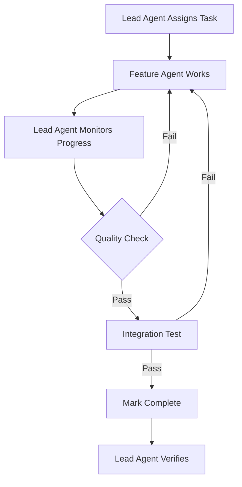

# Directory Restructure Plan for Better Leadership & Monitoring

## 🎯 Goal
Enable the lead agent to monitor, verify, and coordinate all development activities across worktrees.

## 📐 Proposed Structure

### Option 1: Single Repository with Feature Branches (Recommended)
```
pakeaja-crm/                    ← Start Claude here
├── .claude/                    ← Project-wide Claude config
├── dashboard/                  ← Monitoring at root
├── scripts/                    ← Cross-feature scripts
├── docs/                       ← Shared documentation
└── app/                        ← Main Flutter app
    ├── lib/
    ├── test/
    └── pubspec.yaml
```

**Workflow:**
- Each agent works on a feature branch
- Lead agent on main branch can:
  - Switch branches to verify work
  - Run tests across all features
  - Merge verified features
  - Monitor real-time changes

### Option 2: Monorepo with Workspaces (Current Fix)
```
pakeaja-crm-workspace/          ← Start Claude here (parent dir)
├── .claude/                    ← Workspace Claude config
├── dashboard/                  ← Moved to parent
├── scripts/                    ← Workspace scripts
│   ├── monitor-all.sh
│   ├── verify-modules.sh
│   └── integrate.sh
├── mobile-app/                 ← Main app
├── mobile-app-auth/            ← Feature worktrees
├── mobile-app-ui/
└── mobile-app-daily-reports/
```

**Benefits:**
- Lead agent can access ALL worktrees
- Can run verification scripts
- Monitor progress in real-time
- Coordinate integration

## 🚀 Migration Steps

### For Option 1 (Feature Branches):
```bash
# 1. Create new unified repo
git init pakeaja-crm
cd pakeaja-crm

# 2. Copy main app
cp -r ../mobile-app/* .

# 3. Create feature branches
git checkout -b feature/auth
git checkout -b feature/ui-components
git checkout -b feature/daily-reports

# 4. Each agent works on their branch
# Lead agent can switch branches to monitor
```

### For Option 2 (Quick Fix):
```bash
# 1. Move to parent directory
cd /Users/kevinzakaria/Documents/pakeaja-crm-worktrees

# 2. Move dashboard to parent
mv mobile-app/dashboard .

# 3. Create monitoring scripts
mkdir scripts
cat > scripts/monitor-all.sh << 'EOF'
#!/bin/bash
for dir in mobile-app*; do
  echo "=== $dir ==="
  cd $dir
  git status
  git log -1 --oneline
  cd ..
done
EOF

# 4. Start Claude from parent directory
claude-code
```

## 📊 Comparison

| Aspect | Option 1 (Branches) | Option 2 (Parent Dir) |
|--------|-------------------|---------------------|
| Setup Complexity | High (restructure) | Low (just move up) |
| Monitoring | Excellent | Good |
| Integration | Native Git | Manual sync |
| Conflict Resolution | Git handles | Manual process |
| Agent Isolation | Branch protection | Directory isolation |
| Verification | Git diff/test | File comparison |

## 🎯 Leadership Capabilities Gained

### With Restructure, Lead Agent Can:

1. **Real-time Monitoring**
   ```bash
   # See what each agent is doing
   git branch -v
   git log --all --oneline --graph
   
   # Or for worktrees
   find . -name "*.dart" -newer dashboard/last-check
   ```

2. **Verification Suite**
   ```bash
   # Run verification across all modules
   ./scripts/verify-all-modules.sh
   
   # Check specific implementation
   cd mobile-app-auth && flutter test
   ```

3. **Integration Testing**
   ```bash
   # Test integration points
   ./scripts/integration-test.sh
   ```

4. **Progress Tracking**
   ```bash
   # Real implementation metrics
   find . -name "*.dart" | xargs wc -l | sort -n
   ```

5. **Quality Gates**
   ```bash
   # Before marking complete
   ./scripts/quality-check.sh auth
   ```

## 🛡️ Preventing False Completion

### Verification Protocol:
```yaml
Before Marking Complete:
  Lead Agent Must:
    - Review actual code files
    - Run module tests
    - Test integration points
    - Verify against requirements
    - See working demo
    
  Evidence Required:
    - Screenshot of working feature
    - Test results
    - Code coverage report
    - Integration test pass
```

## 📋 Decision Matrix

**Choose Option 1 (Feature Branches) if:**
- Starting new project
- Want best long-term solution
- Comfortable with Git workflows
- Need strong integration

**Choose Option 2 (Parent Directory) if:**
- Want quick fix now
- Keep existing structure
- Minimal disruption
- Start monitoring immediately

## 🚨 Immediate Recommendation

**Do Option 2 Now** - Move Claude to parent directory:
1. Quick to implement (5 minutes)
2. Immediately gain visibility
3. Can monitor auth agent's actual work
4. Verify other agents' progress

**Plan Option 1 for Next Project** - Better architecture for future

## 📝 New Workflow with Monitoring



---

**Bottom Line**: The auth module false completion happened because you couldn't see what was actually built. With restructuring, this won't happen again.