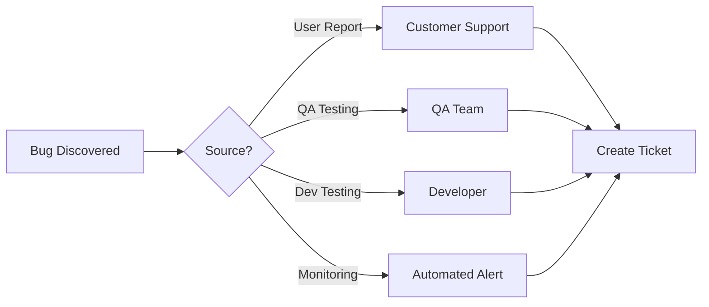

# 🐛 PakeAja CRM Mobile App - Bug Tracking Guide

## Overview

This document outlines the bug tracking process, severity classifications, and workflow for managing issues in the PakeAja CRM Mobile App development.

## Bug Severity Classifications

### 🔴 Critical (P0)
**Response Time**: Immediate (within 2 hours)  
**Resolution Target**: 24 hours

Issues that:
- Prevent app launch or cause crashes on startup
- Result in data loss or corruption
- Block core business functions (daily reports, canvassing)
- Compromise security or expose sensitive data
- Affect all users in production

**Examples**:
- App crashes when submitting daily report
- Offline data not syncing, causing data loss
- Authentication completely broken
- Database corruption issues

### 🟠 High (P1)
**Response Time**: Within 4 hours  
**Resolution Target**: 48 hours

Issues that:
- Major features are broken but workarounds exist
- Affect significant number of users (>30%)
- Degrade performance severely
- Block secondary business workflows

**Examples**:
- Photo upload fails consistently
- GPS location not captured
- Sync delays exceeding 5 minutes
- Search functionality broken

### 🟡 Medium (P2)
**Response Time**: Within 1 business day  
**Resolution Target**: 1 week

Issues that:
- Minor features are broken
- UI/UX issues that confuse users
- Performance degradation (not severe)
- Affect small number of users (<30%)

**Examples**:
- UI elements misaligned on certain devices
- Slow loading of materials database
- Filter options not working properly
- Minor validation errors

### 🟢 Low (P3)
**Response Time**: Within 3 business days  
**Resolution Target**: Next release

Issues that:
- Cosmetic problems
- Minor text/translation issues
- Feature enhancements
- Edge cases affecting <5% users

**Examples**:
- Typos in UI text
- Color inconsistencies
- Animation glitches
- Non-critical feature requests

## Bug Report Template

```markdown
### Bug Report #[NUMBER]

**Date Reported**: YYYY-MM-DD  
**Reporter**: [Name/Role]  
**Severity**: Critical/High/Medium/Low  
**Feature Area**: Auth/Daily Reports/Canvassing/Sync/Materials/UI  
**Device**: [Model, OS Version]  
**App Version**: [Version Number]

#### Summary
[One-line description of the issue]

#### Steps to Reproduce
1. [First step]
2. [Second step]
3. [Continue as needed]

#### Expected Behavior
[What should happen]

#### Actual Behavior
[What actually happens]

#### Screenshots/Recordings
[Attach any visual evidence]

#### Additional Context
- Network conditions: [Online/Offline/Poor connection]
- Frequency: [Always/Sometimes/Rarely]
- First occurrence: [Date/Version]
- Workaround available: [Yes/No - describe if yes]

#### Logs/Error Messages
```
[Paste relevant logs here]
```

#### Impact Assessment
- Users affected: [Number/Percentage]
- Business impact: [Description]
- Data integrity risk: [Yes/No]
```

## Bug Tracking Workflow

### 1. Discovery & Reporting



### 2. Triage Process

**Daily Triage Meeting** (15 minutes)
- Review new bugs
- Assign severity
- Assign to developer
- Set target resolution

**Triage Checklist**:
- [ ] Reproducible?
- [ ] Severity appropriate?
- [ ] Similar bugs exist?
- [ ] Workaround available?
- [ ] Assignment clear?

### 3. Resolution Workflow

```
New → Triaged → In Progress → Code Review → Testing → Resolved → Closed
```

**Status Definitions**:
- **New**: Just reported, awaiting triage
- **Triaged**: Severity assigned, developer assigned
- **In Progress**: Developer actively working
- **Code Review**: Fix implemented, awaiting review
- **Testing**: QA verification in progress
- **Resolved**: Fix verified, awaiting release
- **Closed**: Released to production

### 4. Verification Process

**Developer Verification**:
- [ ] Root cause identified
- [ ] Fix implemented
- [ ] Unit tests added/updated
- [ ] No regression in related features
- [ ] Code reviewed

**QA Verification**:
- [ ] Original issue resolved
- [ ] No new issues introduced
- [ ] Tested on multiple devices
- [ ] Offline scenarios tested
- [ ] Performance impact checked

## Bug Prevention Strategies

### 1. Code Quality Gates

```yaml
Pre-commit Checks:
  - Linting (flutter analyze)
  - Format check (dart format)
  - Unit test coverage (>80%)

Pre-merge Requirements:
  - All tests passing
  - Code review approved
  - No critical lint warnings
  - Documentation updated
```

### 2. Testing Pyramid

```
         /\
        /  \        E2E Tests (10%)
       /----\       - Critical user journeys
      /      \      - Cross-feature workflows
     /--------\     
    /          \    Integration Tests (30%)
   /------------\   - API integration
  /              \  - Database operations
 /----------------\ - Offline/Online sync
/                  \
--------------------  Unit Tests (60%)
                      - Business logic
                      - Data transformations
                      - Utilities
```

### 3. Monitoring & Alerts

**Crash Reporting**:
```dart
// Firebase Crashlytics integration
void main() {
  FlutterError.onError = FirebaseCrashlytics.instance.recordFlutterError;
  
  runZonedGuarded(() {
    runApp(MyApp());
  }, (error, stack) {
    FirebaseCrashlytics.instance.recordError(error, stack);
  });
}
```

**Performance Monitoring**:
- App startup time
- Screen load times
- API response times
- Sync duration
- Memory usage

**Error Tracking**:
- Network failures
- Sync conflicts
- Validation errors
- Permission denials

## Common Bug Categories

### 1. Offline/Sync Issues

**Common Problems**:
- Data not syncing after coming online
- Duplicate entries after sync
- Sync queue getting stuck
- Conflict resolution failures

**Prevention**:
- Robust queue management
- Idempotent operations
- Clear conflict resolution rules
- Comprehensive sync testing

### 2. Device-Specific Issues

**Common Problems**:
- Layout issues on small screens
- Camera permissions on specific Android versions
- Memory issues on low-end devices
- GPS accuracy variations

**Prevention**:
- Test on multiple devices
- Use responsive design
- Handle permissions gracefully
- Optimize memory usage

### 3. State Management Issues

**Common Problems**:
- Stale data displayed
- State not persisting
- Race conditions
- Memory leaks

**Prevention**:
- Clear state management patterns
- Proper disposal of resources
- Avoid unnecessary rebuilds
- Use immutable state

## Bug Metrics & KPIs

### Key Metrics to Track

1. **Bug Discovery Rate**
   - New bugs per release
   - Bugs found in production vs testing
   - Time to discovery

2. **Resolution Metrics**
   - Mean time to resolution (MTTR)
   - Resolution rate by severity
   - Reopen rate

3. **Quality Metrics**
   - Bug density (bugs per KLOC)
   - Escape rate (bugs found in production)
   - Customer-reported vs internally-found ratio

### Monthly Bug Report Template

```markdown
## Monthly Bug Report - [Month Year]

### Summary
- Total bugs reported: X
- Total bugs resolved: Y
- Critical bugs: A (resolved: B)
- Current backlog: Z

### Metrics
- Average resolution time: X days
- Customer satisfaction: Y%
- Crash-free sessions: Z%

### Top Issues
1. [Issue description] - [Status]
2. [Issue description] - [Status]
3. [Issue description] - [Status]

### Improvements Made
- [Process improvement]
- [Tool implementation]
- [Training conducted]

### Action Items
- [ ] [Action item 1]
- [ ] [Action item 2]
```

## Tools & Integration

### 1. Bug Tracking Tools

**GitHub Issues** (Recommended)
- Labels for severity, feature area
- Milestones for releases
- Projects for sprint planning
- Automation with GitHub Actions

**Alternative Tools**:
- Jira
- Linear
- Bugzilla
- Trello

### 2. Crash Reporting

**Firebase Crashlytics**:
```yaml
# pubspec.yaml
dependencies:
  firebase_crashlytics: ^3.4.0
```

### 3. Error Monitoring

**Sentry Integration**:
```dart
// Initialize Sentry
await SentryFlutter.init(
  (options) {
    options.dsn = 'YOUR_DSN';
    options.environment = 'production';
    options.tracesSampleRate = 0.3;
  },
);
```

## Bug Fix Checklist

### For Developers

- [ ] Bug reproduced locally
- [ ] Root cause identified
- [ ] Fix implemented
- [ ] Unit tests added/updated
- [ ] Integration tests added if needed
- [ ] No regression in related features
- [ ] Code follows style guide
- [ ] Documentation updated
- [ ] PR created with bug reference

### For QA Team

- [ ] Fix verified on original scenario
- [ ] Tested edge cases
- [ ] Tested on multiple devices
- [ ] Tested offline scenarios
- [ ] Performance impact assessed
- [ ] No new issues introduced
- [ ] Release notes updated

### For Release Manager

- [ ] All P0/P1 bugs resolved
- [ ] Release notes include bug fixes
- [ ] Stakeholders notified
- [ ] Rollback plan ready
- [ ] Monitoring alerts configured

## Emergency Response Plan

### For Critical Production Bugs

1. **Immediate Actions** (0-30 minutes)
   - Assess impact and scope
   - Notify stakeholders
   - Implement temporary workaround if possible
   - Start root cause analysis

2. **Short-term Fix** (30 minutes - 4 hours)
   - Develop and test hotfix
   - Deploy to staging
   - Quick verification
   - Deploy to production

3. **Long-term Solution** (1-7 days)
   - Comprehensive fix
   - Full testing cycle
   - Code review
   - Normal release process

### Communication Template

```
Subject: [CRITICAL] Production Issue - [Brief Description]

Status: [Investigating/Fix in Progress/Resolved]
Impact: [Number of users affected]
Workaround: [Available/None]

Timeline:
- Issue discovered: [Time]
- Investigation started: [Time]
- Root cause identified: [Time]
- Fix deployed: [Time]

Next Steps:
- [Action items]

Updates will be provided every [30 minutes/hour].
```

## Continuous Improvement

### Weekly Bug Review

- Review bug trends
- Identify patterns
- Update prevention strategies
- Refine processes

### Quarterly Retrospective

- Analyze bug metrics
- Review major incidents
- Update documentation
- Plan preventive measures

### Training & Knowledge Sharing

- Bug pattern workshops
- Debugging techniques
- Tool training
- Post-mortem reviews

---

**Remember**: Every bug is an opportunity to improve the product and our processes. Focus on prevention, not blame.