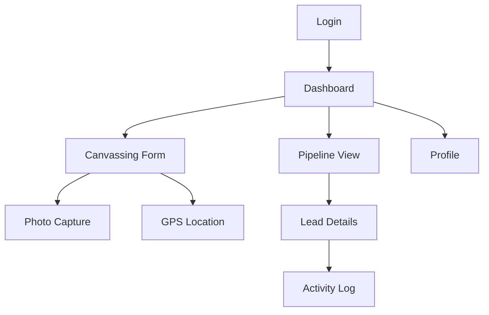

# 📱 PakeAja CRM Mobile App Development Specification

> **Complete Technical Guide for Mobile Development Team**  
> Version: 1.0 | Date: January 2025 | Target: Field Sales Team

---

## 🎯 Executive Summary

### Project Overview
PakeAja CRM Mobile App is an **offline-first field sales application** designed for coating industry sales teams. The app integrates seamlessly with the existing web-based CRM system built on Supabase.

### Key Requirements
- **Primary Users**: Field Sales Representatives & Managers
- **Offline Support**: 1-3 days data retention for unsubmitted reports
- **File Upload**: 50MB per submission capacity
- **Real-time Sync**: Bi-directional with desktop CRM
- **Target Platforms**: iOS (12.0+), Android (API 21+)

---

## 🏗️ Technical Architecture

### Recommended Tech Stack
```yaml
Framework: React Native + TypeScript
State Management: @tanstack/react-query + Zustand
Navigation: @react-navigation/native
UI Components: react-native-paper
Offline Storage: react-native-mmkv + @react-native-async-storage/async-storage
Database Sync: @supabase/supabase-js
Image Handling: react-native-image-picker
Maps & GPS: @react-native-maps/maps + react-native-geolocation-service
Push Notifications: @react-native-firebase/messaging
```

### Backend Infrastructure (Ready)
- **Database**: Supabase PostgreSQL
- **Authentication**: Supabase Auth with RLS
- **File Storage**: Supabase Storage
- **Real-time**: Supabase Realtime subscriptions
- **API**: REST endpoints with automatic OpenAPI docs

---

## 📊 Database Schema (Production Ready)

### Core Tables
```sql
-- User Management
users (id, email, role, territory, organization_id)
profiles (id, full_name, phone, is_active)

-- Field Operations
canvassing_reports (comprehensive visit data with GPS)
canvassing_photos (image uploads with metadata)
leads (sales pipeline management)
activities (activity tracking with temperature impact)

-- Supporting Data
companies (company database for autocomplete)
customers (customer management)
territories (field assignment)
notifications (real-time alerts)
```

### Key Relationships
```sql
canvassing_reports → leads (1:1 conversion tracking)
users → territories (field assignment)
activities → leads (pipeline temperature updates)
canvassing_photos → canvassing_reports (visual documentation)
```

---

## 🚀 Core Features Implementation

### 1. Authentication & User Management
```typescript
interface UserProfile {
  id: string;
  role: 'sales_rep' | 'sales_manager' | 'field_sales';
  full_name: string;
  phone?: string;
  territory?: string;
  organization_id: string;
}

// Implementation
- Supabase Auth integration
- Biometric login (iOS Face ID/Touch ID, Android Fingerprint)
- Secure token storage (Keychain/Keystore)
- Role-based UI adaptation
```

### 2. Field Canvassing (Core Feature)
```typescript
interface CanvassingReport {
  // Company Information
  company_name: string;
  company_address: string;
  contact_person: string;
  contact_position?: string;
  contact_phone?: string;
  contact_email?: string;
  
  // Visit Details
  visit_date: string;
  visit_outcome: 'interested' | 'not_interested' | 'follow_up_needed' | 'already_customer' | 'competitor_locked';
  project_segment: 'decorative' | 'floor' | 'marine' | 'protective' | 'steel' | 'waterproofing' | 'others';
  
  // Potential Assessment
  potential_type: 'area' | 'materials' | 'value';
  potential_area?: number;
  potential_materials?: string;
  potential_value?: number;
  
  // Follow-up
  next_action?: string;
  next_action_date?: string;
  priority: 'low' | 'medium' | 'high';
  
  // Media & Location
  photos: CanvassingPhoto[];
  gps_latitude?: number;
  gps_longitude?: number;
  
  // Sync Status
  is_synced: boolean;
  created_offline?: boolean;
}

// Key Features
- Offline form completion
- GPS auto-capture
- Photo capture with compression
- Company autocomplete (cached)
- Real-time validation
- Sync queue management
```

### 3. Sales Pipeline Integration
```typescript
interface Lead {
  id: string;
  lead_number: string;
  canvassing_report_id?: string;
  stage: 'lead' | 'qualified' | 'proposal' | 'negotiation' | 'closing' | 'won' | 'lost';
  temperature: number; // -20 to 100
  temperature_status: 'cold' | 'warm' | 'hot' | 'critical';
  estimated_value?: number;
  probability: number; // 0-100%
  expected_close_date?: string;
  
  // Auto-conversion from canvassing
  auto_created_lead?: boolean;
}

// Features
- Pipeline Kanban view
- Temperature tracking with smart scoring
- Quick actions (call, email, message)
- Conversion tracking from canvassing
```

---

## 🔌 API Endpoints (Ready for Consumption)

### Authentication
```http
POST /auth/v1/token (Supabase Auth)
GET /auth/v1/user
POST /auth/v1/logout
```

### Canvassing Operations
```http
# Report Management
POST /rest/v1/canvassing_reports
GET /rest/v1/canvassing_reports?select=*&order=visit_date.desc
PUT /rest/v1/canvassing_reports?id=eq.{id}

# Photo Upload
POST /storage/v1/object/canvassing-photos/{filename}
GET /storage/v1/object/public/canvassing-photos/{filename}

# Conversion to Lead
POST /rest/v1/rpc/convert_canvassing_to_lead
```

### Sales Pipeline
```http
GET /rest/v1/leads?select=*,customer:customers(*)
POST /rest/v1/leads
PUT /rest/v1/leads?id=eq.{id}

# Activities
POST /rest/v1/activities
GET /rest/v1/activities?lead_id=eq.{id}
```

### Sync & Offline
```http
# Batch operations for offline sync
POST /rest/v1/rpc/sync_offline_reports
GET /rest/v1/rpc/get_sync_status
```

---

## 📴 Offline-First Implementation

### Data Storage Strategy
```typescript
// Storage Layers
1. Secure Storage (Auth tokens) - react-native-keychain
2. Fast Storage (User preferences) - react-native-mmkv  
3. Form Queue (Pending submissions) - AsyncStorage
4. Image Cache (Photo staging) - File system
5. Reference Data (Companies, etc.) - SQLite

// Sync Architecture
interface SyncManager {
  // Queue management
  addToQueue(data: OfflineData): void;
  processQueue(): Promise<SyncResult>;
  
  // Conflict resolution
  resolveConflicts(conflicts: DataConflict[]): ResolvedData[];
  
  // Background sync
  scheduleBackgroundSync(): void;
}
```

### Offline Capabilities Matrix
```yaml
✅ Full Offline Support:
  - Create canvassing reports
  - Take and cache photos
  - View cached pipeline data
  - Log activities
  - GPS location tracking

⚠️ Limited Offline:
  - Company autocomplete (cached data only)
  - Pipeline updates (read-only cached)

❌ Requires Online:
  - Real-time notifications
  - Live team collaboration
  - Fresh company data
```

---

## 🎨 UI/UX Guidelines

### Design System
```typescript
// Theme Configuration
const theme = {
  colors: {
    primary: '#1976d2',      // PakeAja Blue
    secondary: '#ff9800',    // Orange accent
    success: '#4caf50',      // Green
    warning: '#ff9800',      // Orange
    error: '#f44336',        // Red
    background: '#fafafa',   // Light gray
  },
  spacing: {
    xs: 4, sm: 8, md: 16, lg: 24, xl: 32
  }
};

// Component Library
- Use Material Design 3 principles
- Consistent spacing and typography
- Accessibility compliant (WCAG 2.1 AA)
- Dark mode support
```

### Screen Flow


---

## 🔒 Security Implementation

### Data Protection
```typescript
// Encryption
- All local data encrypted with device keychain
- Photos stored in secure app directory
- API calls over HTTPS only
- Certificate pinning for production

// Authentication
- Biometric authentication
- Session token refresh
- Automatic logout on inactivity
- Device registration

// Privacy
- Location permission management
- Camera permission handling
- Photo metadata stripping
- GDPR compliance
```

---

## 🧪 Testing Strategy

### Test Coverage Requirements
```yaml
Unit Tests: >80% coverage
  - Business logic
  - Data transformations
  - Sync operations

Integration Tests:
  - API communication
  - Database operations
  - Offline/online transitions

E2E Tests:
  - Critical user flows
  - Canvassing report creation
  - Pipeline navigation
  - Photo upload

Performance Tests:
  - App startup time (<3s)
  - Large dataset handling
  - Memory usage optimization
```

### Test Data Setup
```typescript
// Mock Data Generation
- Sample canvassing reports (100+)
- Test companies and contacts
- Various user roles and permissions
- Offline scenarios simulation
```

---

## 📱 Platform-Specific Considerations

### iOS Implementation
```typescript
// Required Capabilities
- Camera usage description
- Location when in use
- Background app refresh
- Push notifications

// Performance Optimizations
- Image compression for memory management
- Background task handling
- CoreData integration for offline storage
```

### Android Implementation
```typescript
// Required Permissions
<uses-permission android:name="android.permission.CAMERA" />
<uses-permission android:name="android.permission.ACCESS_FINE_LOCATION" />
<uses-permission android:name="android.permission.WRITE_EXTERNAL_STORAGE" />

// Background Tasks
- WorkManager for sync operations
- Room database for offline storage
- Notification channels setup
```

---

## 🚀 Development Phases

### Phase 1: Core MVP (4-6 weeks)
```yaml
Week 1-2: Project Setup & Authentication
  - React Native project initialization
  - Supabase integration
  - Authentication flow
  - Navigation setup

Week 3-4: Canvassing Feature
  - Form implementation
  - Photo capture
  - GPS integration
  - Offline storage

Week 5-6: Basic Pipeline & Sync
  - Pipeline view (read-only)
  - Sync implementation
  - Testing & debugging
```

### Phase 2: Enhanced Features (3-4 weeks)
```yaml
Week 7-8: Advanced Pipeline
  - Lead management
  - Activity tracking
  - Temperature system

Week 9-10: Polish & Performance
  - UI/UX improvements
  - Performance optimization
  - Comprehensive testing
```

### Phase 3: Production Ready (2-3 weeks)
```yaml
Week 11-12: Production Preparation
  - Security audit
  - Performance testing
  - App store preparation

Week 13: Deployment & Monitoring
  - Beta testing with sales team
  - Production deployment
  - Monitoring setup
```

---

## 📊 Performance Requirements

### Technical KPIs
```yaml
App Performance:
  - Cold start time: <3 seconds
  - Warm start time: <1 second
  - Memory usage: <200MB typical
  - Battery impact: Minimal
  - Crash rate: <1%

Network & Sync:
  - Offline functionality: 100% for core features
  - Sync success rate: >98%
  - Photo upload success: >95%
  - Data conflict resolution: Automatic

User Experience:
  - Form submission: <2 seconds
  - Photo capture: <1 second
  - GPS acquisition: <10 seconds
  - Search response: <500ms
```

---

## 🔧 Development Environment Setup

### Prerequisites
```bash
# Development Tools
Node.js 18+ 
React Native CLI
Android Studio / Xcode
VS Code with React Native extensions

# Environment Setup
npx react-native init PakeajaCRM --template react-native-template-typescript
cd PakeajaCRM

# Core Dependencies
npm install @supabase/supabase-js
npm install @react-navigation/native @react-navigation/stack
npm install react-native-paper
npm install react-native-mmkv
npm install @react-native-async-storage/async-storage
npm install react-native-image-picker
npm install @react-native-maps/maps
npm install react-native-geolocation-service
```

### Configuration Files
```typescript
// supabase.ts
export const supabase = createClient(
  'https://your-project.supabase.co',
  'your-anon-key'
);

// types.ts
export interface CanvassingReport { /* ... */ }
export interface Lead { /* ... */ }
// ... other interfaces
```

---

## 📚 Additional Resources

### Documentation Links
- [Supabase React Native Guide](https://supabase.com/docs/guides/getting-started/tutorials/with-react-native)
- [React Native Performance](https://reactnative.dev/docs/performance)
- [Material Design 3](https://m3.material.io/)

### Team Contacts
- **Backend Support**: Available for Supabase schema questions
- **Design System**: UI/UX guidelines and assets
- **DevOps**: CI/CD pipeline and deployment support

---

## ✅ Ready-to-Use Assets

### Backend Infrastructure
- ✅ **Supabase Project**: Fully configured and production-ready
- ✅ **Database Schema**: All tables created with proper relationships
- ✅ **API Endpoints**: RESTful APIs with automatic documentation
- ✅ **Authentication**: Row Level Security implemented
- ✅ **File Storage**: Configured for photo uploads
- ✅ **Real-time**: WebSocket subscriptions ready

### Frontend Services  
- ✅ **Service Layer**: TypeScript services for all operations
- ✅ **Data Models**: Complete type definitions
- ✅ **Business Logic**: Canvassing and pipeline logic implemented
- ✅ **Sync Logic**: Offline queue and conflict resolution

---

**🎯 Success Criteria**: The mobile app should enable field sales teams to efficiently conduct canvassing activities offline, automatically sync data when online, and seamlessly integrate with the desktop CRM workflow.

**📞 Support**: For technical questions during development, refer to the existing codebase in `/src/lib/services/` and `/src/types/` directories.** 