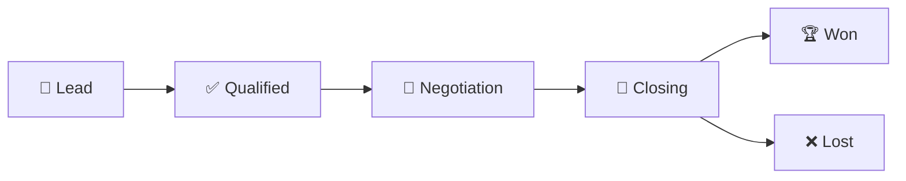

# 📈 Sales Pipeline Overview


The **Sales Pipeline** is your command center for managing deals from initial lead to successful closure. It uses a unique temperature-based system to help you prioritize opportunities.


## 🎯 What is the Sales Pipeline?

The Sales Pipeline in Horizon Suite is designed specifically for the Indonesian coating industry:

* 🔥 **Temperature-Based Prioritization**: Visual urgency indicators
* 🎨 **Deal Type Classification**: Supply, Apply, or Combined deals
* 📊 **Stage-Based Management**: Clear progression tracking
* 🤝 **Team Collaboration**: Comments, assignments, and notifications
* 📱 **Mobile Optimization**: Manage deals anywhere

## 🌡️ Temperature System


**Unique Feature**: Horizon Suite's temperature system helps you focus on the hottest opportunities first!


### Temperature Ranges

<table>
  <thead>
    <tr>
      <th width="120">Temperature</th>
      <th width="100">Range</th>
      <th width="150">Status</th>
      <th>Action Required</th>
    </tr>
  </thead>
  <tbody>
    <tr>
      <td>🧊 <strong>Cold</strong></td>
      <td>0-25°C</td>
      <td>New leads, minimal activity</td>
      <td>Schedule initial contact</td>
    </tr>
    <tr>
      <td>🔥 <strong>Warm</strong></td>
      <td>26-50°C</td>
      <td>Qualified leads, regular contact</td>
      <td>Maintain engagement</td>
    </tr>
    <tr>
      <td>🌋 <strong>Hot</strong></td>
      <td>51-75°C</td>
      <td>Active negotiation, high interest</td>
      <td>Focus attention, accelerate</td>
    </tr>
    <tr>
      <td>⚡ <strong>Critical</strong></td>
      <td>76-100°C</td>
      <td>Closing soon, urgent attention</td>
      <td>Daily contact, remove obstacles</td>
    </tr>
  </tbody>
</table>

### 🌡️ Temperature Factors

Temperature automatically adjusts based on:

#### 📈 Positive Factors (+Temperature)
* **Recent Activities**: Calls, meetings, emails
* **Customer Engagement**: Quote views, responses
* **Deal Progress**: Stage advancement
* **Urgency Indicators**: Timeline pressure

#### 📉 Negative Factors (-Temperature)
* **Inactivity**: No contact for extended periods
* **Delayed Responses**: Slow customer communication
* **Stage Stagnation**: Deals stuck in same stage
* **Competition**: Competitor involvement

## 🎯 Deal Stages

### Stage Progression

The pipeline follows a logical progression through these stages:

### 🎯 Lead Stage
**Purpose**: Initial contact and basic qualification

**Key Activities**:
* 📞 **Make contact** with decision makers
* 🎯 **Qualify needs** and budget
* 📋 **Gather requirements** and specifications
* 📅 **Schedule follow-up** meetings

**Exit Criteria**:
* ✅ Confirmed coating need
* ✅ Budget availability verified
* ✅ Decision maker identified
* ✅ Timeline established

### ✅ Qualified Stage
**Purpose**: Detailed needs assessment and solution design

**Key Activities**:
* 🚗 **Site visits** for assessment
* 🧪 **Technical discussions** and specifications
* 💰 **Budget confirmation** and approval process
* 📄 **Proposal preparation** and pricing

**Exit Criteria**:
* ✅ Technical requirements defined
* ✅ Budget approved
* ✅ Proposal requested
* ✅ Evaluation criteria understood

### 💼 Negotiation Stage
**Purpose**: Proposal review and terms discussion

**Key Activities**:
* 📄 **Quote presentation** and explanation
* 💬 **Terms negotiation** (price, delivery, payment)
* 🔄 **Proposal revisions** based on feedback
* 🤝 **Stakeholder alignment** and approvals

**Exit Criteria**:
* ✅ Terms agreed upon
* ✅ Final approvals obtained
* ✅ Contract terms finalized
* ✅ Ready for purchase order

### 🏁 Closing Stage
**Purpose**: Final negotiations and contract execution

**Key Activities**:
* 📋 **Purchase order** processing
* 📝 **Contract finalization** and signing
* 📅 **Delivery scheduling** and logistics
* 💳 **Payment terms** confirmation

**Exit Criteria**:
* ✅ Purchase order received
* ✅ Contract signed
* ✅ Payment terms agreed
* ✅ Delivery scheduled

### 🏆 Won Stage
**Purpose**: Deal closed successfully, after-sales management

**Key Activities**:
* 🚚 **Delivery coordination** and tracking
* 🔧 **Installation support** (if applicable)
* 📋 **Quality assurance** and inspection
* 🤝 **Customer satisfaction** follow-up

### ❌ Lost Stage
**Purpose**: Deal analysis and future opportunity identification

**Key Activities**:
* 📊 **Loss analysis** and reason documentation
* 🔍 **Competitor analysis** and market intelligence
* 📅 **Future opportunity** scheduling
* 📚 **Lessons learned** documentation

## 🎨 Deal Types (S/A/S+A)


**Industry-Specific**: These deal types reflect the coating industry's business models.


### 🔵 [S] Supply Only
**Description**: Material supply without application services

**Characteristics**:
* **Customer Responsibility**: Application and labor
* **Our Role**: Product supply and technical support
* **Margin**: Lower margin, higher volume
* **Examples**: Paint to contractors, coating materials to applicators

**Key Considerations**:
* ✅ Product quality and availability
* ✅ Technical documentation and support
* ✅ Competitive pricing
* ✅ Delivery reliability

### 🟢 [A] Apply Only
**Description**: Application services using customer's materials

**Characteristics**:
* **Customer Responsibility**: Material procurement
* **Our Role**: Professional application services
* **Margin**: Service-based pricing
* **Examples**: Specialized application, maintenance work

**Key Considerations**:
* ✅ Technical expertise and certification
* ✅ Equipment and workforce availability
* ✅ Quality guarantees
* ✅ Safety compliance

### 🟣 [S+A] Supply + Apply
**Description**: Complete solution with materials and application

**Characteristics**:
* **Customer Responsibility**: Project specification and approval
* **Our Role**: End-to-end solution delivery
* **Margin**: Highest margin, complete control
* **Examples**: Turnkey coating projects, facility maintenance

**Key Considerations**:
* ✅ Project management capabilities
* ✅ Resource coordination
* ✅ Quality control throughout
* ✅ Timeline management

## 📊 Pipeline Views

### 🎯 Kanban View (Default)
**Best For**: Visual deal management and stage progression

**Features**:
* **Drag & Drop**: Move deals between stages
* **Color Coding**: Temperature-based visual indicators
* **Quick Actions**: Instant activity logging
* **Deal Summaries**: Key information at a glance

### 📋 List View
**Best For**: Detailed deal analysis and bulk operations

**Features**:
* **Sortable Columns**: Organize by any field
* **Bulk Actions**: Update multiple deals
* **Detailed Information**: All deal data visible
* **Export Options**: Data export capabilities

### 📈 Analytics View
**Best For**: Performance analysis and forecasting

**Features**:
* **Pipeline Metrics**: Conversion rates and velocity
* **Revenue Forecasting**: Probability-weighted projections
* **Performance Trends**: Historical analysis
* **Team Comparisons**: Individual and team metrics

## ⚡ Quick Actions

### Stage-Specific Actions

Each stage has optimized quick actions:

#### 🎯 Lead Stage Actions
* 📞 **Call**: Log phone conversations
* 📅 **Schedule Meeting**: Set up appointments
* 📧 **Send Info**: Share company information

#### ✅ Qualified Stage Actions
* 📄 **Send Quote**: Create and send proposals
* 🚗 **Site Visit**: Schedule on-site assessments
* 📦 **Check Stock**: Verify material availability

#### 💼 Negotiation Stage Actions
* 💰 **Offer Discount**: Apply pricing adjustments
* 📝 **Revise Quote**: Update proposal terms
* 👥 **Escalate**: Involve management

#### 🏁 Closing Stage Actions
* 📋 **Get PO**: Request purchase order
* ⏰ **Extend**: Adjust timeline expectations

## 💬 Comments & Collaboration

### 🗨️ Internal Communication
* **Team Comments**: Internal discussions about deals
* **@Mentions**: Notify specific team members
* **Thread Replies**: Organized conversation flow
* **Notification System**: Real-time updates

### 📝 Comment Features
* **Rich Text**: Formatting and links
* **File Attachments**: Documents and images
* **Activity Integration**: Comments linked to activities
* **Search Capability**: Find specific discussions

## 🔍 Filtering & Search

### 🎯 Smart Filters
* **Temperature Range**: Focus on hot deals
* **Deal Stage**: Specific pipeline stages
* **Deal Type**: S, A, or S+A deals
* **Sales Rep**: Individual or team filtering
* **Date Ranges**: Time-based analysis

### 🔍 Advanced Search
* **Text Search**: Deal names and customer names
* **Custom Fields**: Industry-specific criteria
* **Saved Filters**: Frequently used combinations
* **Export Results**: Filtered data export

## 📱 Mobile Features

### 🔄 Offline Capabilities
* **Deal Updates**: Modify deals without internet
* **Activity Logging**: Record activities offline
* **Comment Addition**: Add comments and sync later
* **Photo Attachments**: Include visual documentation

### 📍 Location Integration
* **GPS Tracking**: Automatic location for activities
* **Customer Mapping**: Visual territory management
* **Route Optimization**: Efficient visit planning

## 🎯 Best Practices

### 🌅 Daily Pipeline Management
1. **Review Hot Deals**: Focus on 51°C+ opportunities
2. **Update Activities**: Log all customer interactions
3. **Move Stagnant Deals**: Advance or archive inactive deals
4. **Plan Follow-ups**: Schedule next actions

### 📊 Weekly Pipeline Health
1. **Temperature Analysis**: Identify cooling deals
2. **Stage Distribution**: Balance across pipeline stages
3. **Conversion Tracking**: Monitor stage progression rates
4. **Team Coordination**: Share insights and strategies

### 📈 Monthly Performance Review
1. **Won/Lost Analysis**: Understand success factors
2. **Pipeline Velocity**: Measure deal progression speed
3. **Forecast Accuracy**: Compare predictions to results
4. **Process Improvement**: Refine sales methodology

## 🏆 Success Metrics

### 📊 Key Performance Indicators
* **Conversion Rate**: Lead to Won percentage
* **Pipeline Velocity**: Average days per stage
* **Deal Size**: Average revenue per deal
* **Temperature Trend**: Pipeline health indicator

### 🎯 Target Benchmarks
* **Conversion Rate**: 25%+ (Industry average: 15%)
* **Average Temperature**: 40°C+ for active pipeline
* **Sales Cycle**: <60 days from Lead to Won
* **Pipeline Coverage**: 4x monthly quota

---


**Ready to master the pipeline?** Check out our [Temperature System](temperature-system.md) guide to learn advanced prioritization techniques!


## 🔗 Related Topics


[temperature-system.md](temperature-system.md)



[deal-management.md](deal-management.md)



[overview.md](../canvassing/overview.md)
 